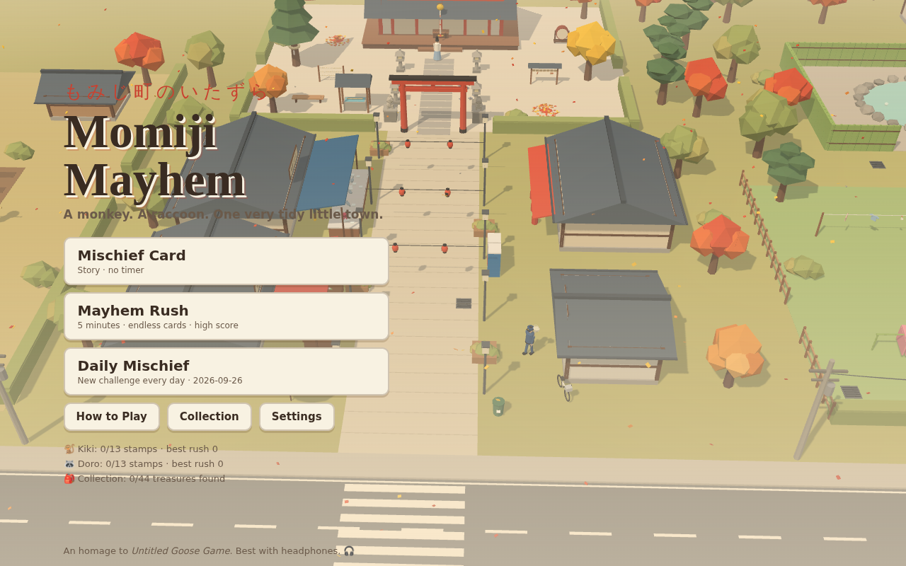
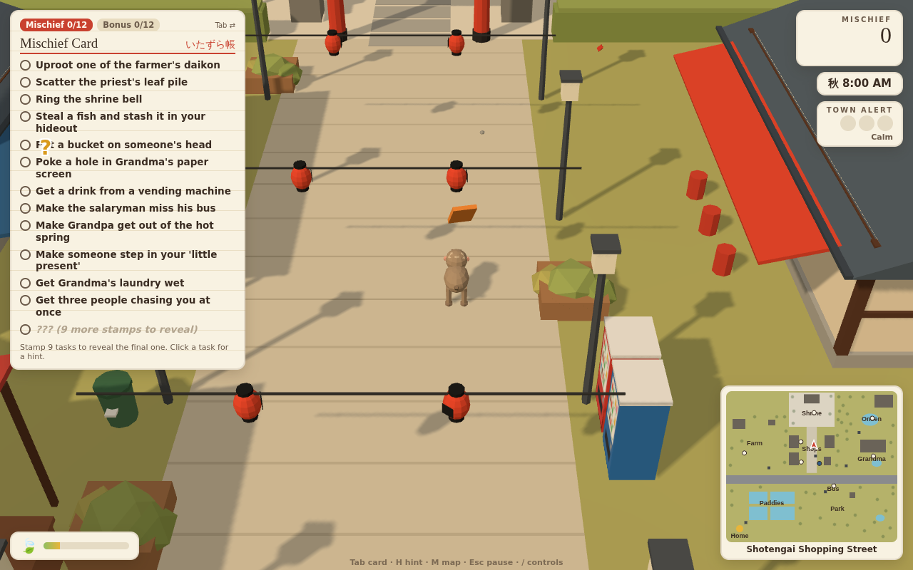
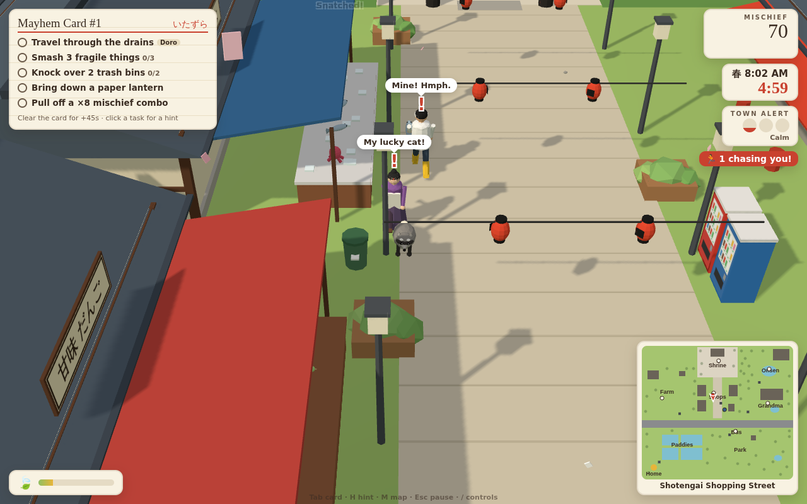
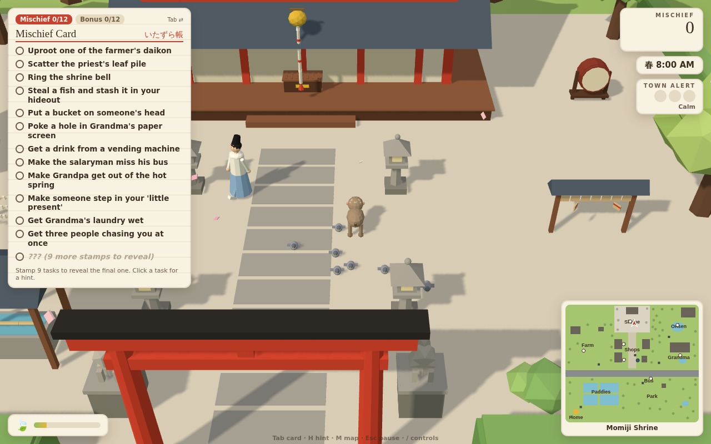
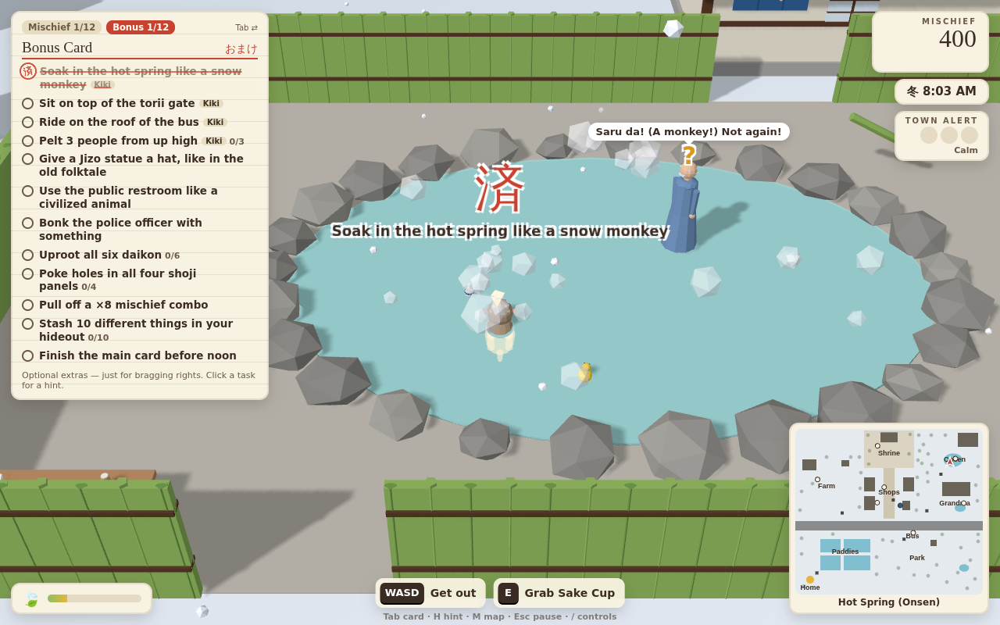

# 🍁 Momiji Mayhem — *もみじ町のいたずら*

A slapstick stealth-sandbox about a mischievous **Japanese macaque** and a **raccoon** loose in a
tidy little Japanese town. It's a loving homage to *Untitled Goose Game*, and it runs in your web browser.



| | |
| --- | --- |
|  |  |
|  |  |

## Play it on your Mac

**Easiest:** download this repo (green **Code** button → **Download ZIP**), unzip it, and
double-click **`index.html`**. It opens in Safari or Chrome. You don't need to install anything:
the whole game is in `game.js`.

Or, from a terminal:

```bash
git clone <this repo> && cd eGPU
open index.html            # or: npx serve .   then visit http://localhost:3000
```

**Want a public link?** This repo is ready for GitHub Pages as it is: go to *Settings → Pages →
Deploy from a branch*, choose this branch and `/ (root)`, and GitHub gives you a URL to play at and share.

> Tip: play with headphones. All the sound (the koto/shamisen/taiko music, barks, splashes and
> townsfolk gibberish) is generated live in the browser and reacts to what you're doing.

## Controls (keyboard + mouse)

| Action | Keys |
| --- | --- |
| Move | **W A S D** or arrow keys |
| Run / Sneak | **Shift** / **C** (or Ctrl) |
| Jump / Climb | **Space** into a tree, wall, pole or ladder (**Space** again to leap off, **S** to climb down) |
| Grab / Drop / Use | **E** or **left-click** |
| Aim & throw | hold **right-click** to aim (you'll see an arc), release to throw (or press **F**) |
| Bark! | **Q** |
| Tear / Eat / Wash | hold **R** |
| Nature's call | **X** when the 🍃 meter fills |
| Camera | scroll to zoom, **[** and **]** to rotate |
| Mischief card, hint, map, controls, pause | **Tab**, **H**, **M**, **/**, **Esc** |

On a Mac trackpad, a two-finger click (or Ctrl-click) is a right-click.

## The two troublemakers

| | 🐒 **Kiki** (macaque) | 🦝 **Doro** (raccoon) |
| --- | --- | --- |
| Movement | Fastest runner, high jumper | Slower, but sneakier |
| Climbing | Trees, walls, poles **and rooftops**, at full speed | Trees and ladders only, slowly |
| Throwing | Throws twice as far, and can pelt people from treetops | Short, weak throws |
| Bark | Ear-splitting screech (キーッ!) makes people drop what they're holding | Hiss (シャーッ!) makes people back away in fear, but they wise up to it |
| Special | Soaks in the hot spring like a snow monkey, which cools the town's alert | Travels the **drain network**, squeezes under fences, **rummages trash** for random loot, **washes** things |
| Weakness | Loud, easy to spot, too big for drains, weak at dragging | Can't reach rooftops, weak thrower |

Most tasks can be done more than one way, and the best route is different for each animal.

## What's in town

* **Farmer Tanaka's field:** daikon to yank out, a scarecrow to shred, a persimmon tree, a well, a bench where he naps.
* **Momiji Shrine:** a leaf-sweeping priest, the offering box, the bell rope, a taiko drum, omikuji fortunes (you really get a fortune).
* **Shotengai shopping street:** the fishmonger, the dango shop and its **Golden Lucky Cat**, vending machines, paper lanterns, and the police box.
* **Hot spring:** Grandpa soaking with his rubber duck, sake and coffee milk.
* **Grandma's house:** laundry line, futon, shoji screens, koi pond, tanuki statue, bonsai.
* **Bus stop and park:** a salaryman waiting for a bus that really comes and goes, a public restroom, pigeons, and three Jizo statues (think *Kasa Jizo*).
* **Your secret hideout** in the bamboo grove: stash stolen treasures here. Nobody follows you in.

## Game modes

* **Mischief Card (story):** a 12-task to-do list. After 9 stamps, a secret finale appears: steal the Golden Lucky Cat. There's also a 12-task **Bonus Card**, with tasks specific to each animal. Progress is saved per animal, and you can pick the season.
* **Mayhem Rush:** 5 minutes with a random season and random cards drawn from 40+ tasks. Clearing a card gives you +45 seconds, and the aim is a high score.
* **Daily Mischief:** the same season and tasks for everyone on a given day, so you can compare scores.

## Design notes: what we kept from *Untitled Goose Game*, and what we fixed

What people loved, and how we amplified it:

* **Slapstick physical comedy.** You can grab, drag, throw, tear and bark, and there's a bucket-on-the-head gag. Townsfolk react with poses, gibberish voices and speech bubbles.
* **The honk.** The bark is a dedicated button, and it changes with what you're holding (a rubber duck squeaks, a can goes tinny, a fish muffles it).
* **The to-do list.** It's a stamp card with red hanko stamps (済), a hidden finale and a bonus card.
* **Reactive music.** An original generative score plays koto phrases while you roam, soft plucks in step with your feet while you sneak, and taiko with shamisen when people chase you.
* **Emergent chains.** A combo meter rewards chaining mischief. Thrown things make noise that lures people, shouts pull the neighbours in, and poop sends people off to wash their shoes.

What people criticised, and what we did about it:

* **"Too short, no replay value."** There are two animals with different abilities, four seasons, Mayhem Rush with randomised cards, a daily challenge, 40+ tasks, a treasure collection (including rare trash finds), unlockable hats and lifetime stats.
* **"Tasks were too obtuse."** Every task has a clear hint (click it or press **H**). A marker shows what you'd grab, prompts show the available keys, and a minimap names every area.
* **"Camera problems."** Buildings and tree canopies fade when they're in the way, you see an x-ray outline of your animal behind walls, and you can zoom and rotate.
* **"NPCs putting things back gets tedious."** Townsfolk only fetch things they actually see. Your hideout is a safe zone, and anything stashed there stays yours.
* **Smarter NPCs, but still fair.** They hear footsteps, investigate noises and remember being pestered: their wariness makes them look around more, see further and stay on guard at their stalls. They also shout for help, and a town-wide alert brings the police officer. But they telegraph with **?** and **!**, get tired, can't climb or fit in drains, lose you in bushes, and give up at your hideout. There's also a *Chill* / *Normal* / *Sharp-eyed* setting.

Nature calls sometimes, as it does for real animals. The meter fills slowly (faster if you snack), and you can go behind a bush, leave a little present on someone's route, or use the park restroom like a civilised animal.

## Development

```bash
npm install
npm run dev     # rebuilds game.js on change and serves at http://localhost:8000
npm run build   # minified game.js
node tests/scenario.mjs    # headless playtests of the main tasks (Playwright + Chromium)
node tests/scenario2.mjs   # character-specific mechanics
node tests/sim.mjs         # 15 minutes of simulated town life (checks NPCs never get stuck)
```

The code is plain JavaScript with [three.js](https://threejs.org), bundled by esbuild into a single
classic script, which is why double-clicking `index.html` works:

* `src/world/` has the town layout, collision, pathfinding, items and interactive fixtures
* `src/actors/` has the player animals, townsfolk models and NPC AI and routines
* `src/game/` has game flow, tasks, scoring and character stats
* `src/audio/` has the synthesised sound effects and adaptive music
* `src/ui/` has the HUD, menus, minimap and stamp card
